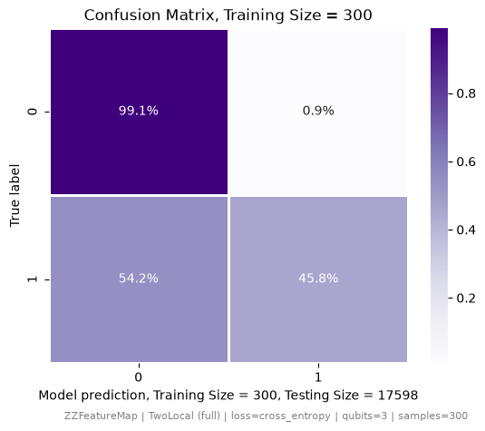
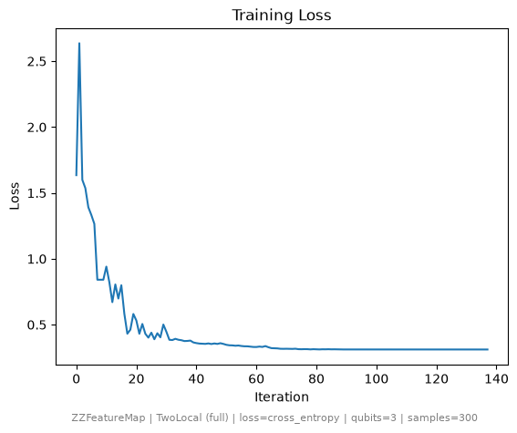
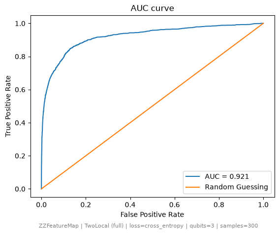

# VQC Run Report

**Generated:** 2026-07-18 19:35:01

## Configuration

| Parameter | Value |
|---|---|
| Feature map | ZZFeatureMap |
| Ansatz | TwoLocal |
| Entanglement | full |
| Loss function | cross_entropy |
| Training samples | 300 |
| Features/qubits | 3 |
| Training set (non-pulsar / pulsar) | 273 / 27 |
| Testing set (non-pulsar / pulsar) | 15986 / 1612 |

## Metrics

| Metric | Value |
|---|---|
| Accuracy | 0.943 |
| Precision | 0.843 |
| Recall | 0.458 |
| F1-score | 0.594 |
| FPR | 0.009 |
| MCC | 0.596 |
| TP / FP / TN / FN | 738 / 137 / 15849 / 874 |

## Confusion Matrix

## Loss Curve

## AUC Curve

## Circuit Diagram

