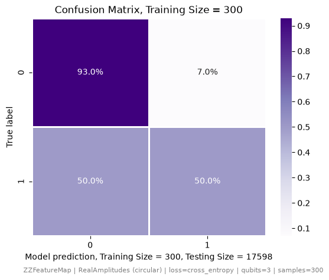
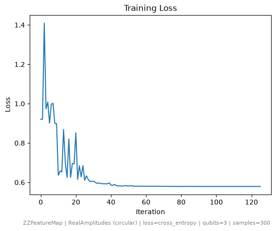
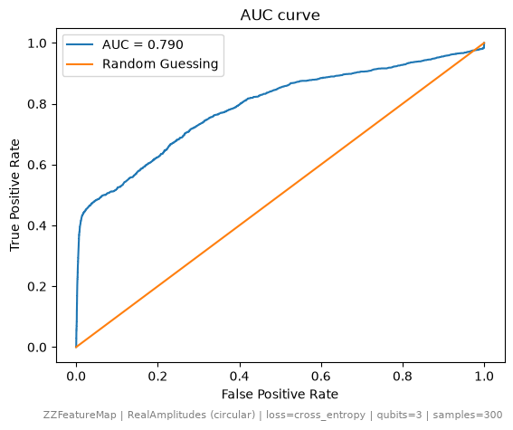

# VQC Run Report

**Generated:** 2026-07-18 21:03:07

## Configuration

| Parameter | Value |
|---|---|
| Feature map | ZZFeatureMap |
| Ansatz | RealAmplitudes |
| Entanglement | circular |
| Loss function | cross_entropy |
| Training samples | 300 |
| Features/qubits | 3 |
| Training set (non-pulsar / pulsar) | 273 / 27 |
| Testing set (non-pulsar / pulsar) | 15986 / 1612 |

## Metrics

| Metric | Value |
|---|---|
| Accuracy | 0.891 |
| Precision | 0.42 |
| Recall | 0.5 |
| F1-score | 0.457 |
| FPR | 0.07 |
| MCC | 0.398 |
| TP / FP / TN / FN | 806 / 1115 / 14871 / 806 |

## Confusion Matrix

## Loss Curve

## AUC Curve

## Circuit Diagram

